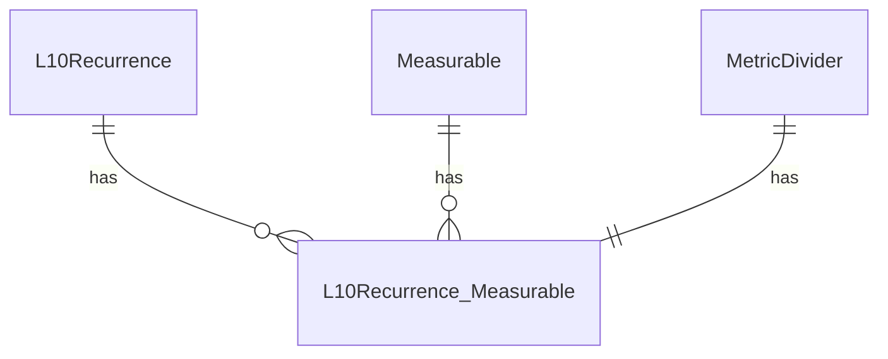
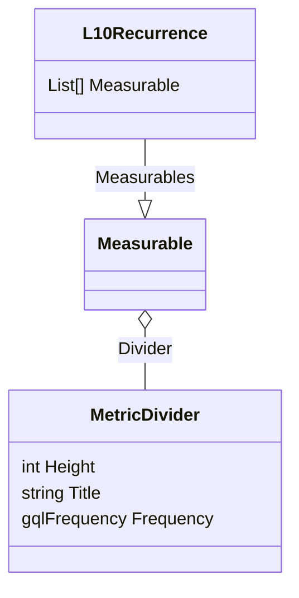

[Root](//../../README.md)

# V3 Metric Divider Implementation

## Database Diagram

In V3 of the Bloom Growth application, Metric Dividers are stored in a separate table and are associated to a Metric (aka Measurable in V1).  Metrics are scoped to a meeting (hence Metric Dividers are also scoped to the same meeting as its associated Metric).

## Class Diagram

